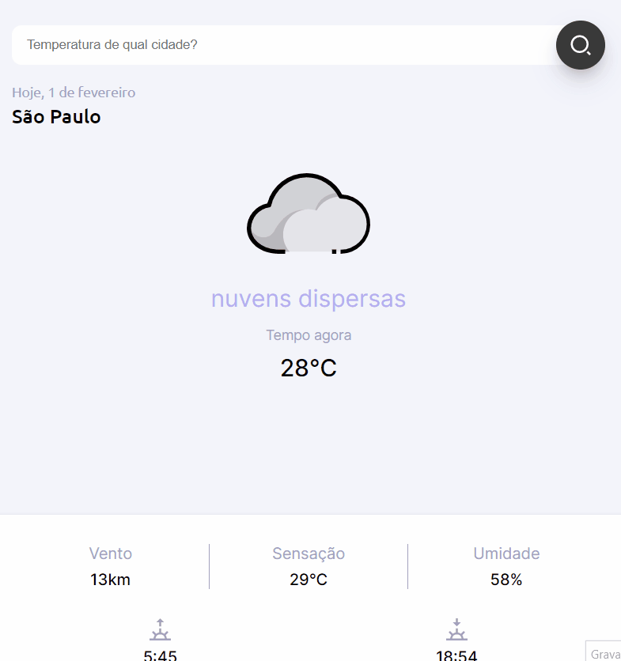

<h1 align="center">
  
  <p>Smart weather for your location </p>
</h1>



<br>

## 📕 About

**Snapclima** is a program that, through your current location or the place you type, shows the thermal sensation, wind speed, humidity, the time of sunrise and sunset.

<br>

## 🌥️ API Weather
The One Call API provides the following weather data for any geographical coordinates:
- Current weather
- Minute forecast for 1 hour
- Hourly forecast for 48 hours
- Daily forecast for 8 days
- National weather alerts
- Historical weather data for 40+ years back 
 (since January 1, 1979)

<br>

## 🧑‍🏭 Get to work
Create an [OpenWeather](https://openweathermap.org/api) account and get a key for full API use
```bash
# create a constant for organization and store your key

const api_key = "7a02b390702dd039a0704a5e49b9251b";
```

<br>

 ## 🔨 Tools
 - [HTML](https://developer.mozilla.org/pt-BR/docs/Web/HTML)
 - [CSS](https://developer.mozilla.org/pt-BR/docs/Web/CSS)
 - [Javascript](https://developer.mozilla.org/pt-BR/docs/Web/JavaScript)

<br>

## ⚠️ Warning 
<p align="center">For full use of the program it is necessary to enable localization.</p>


